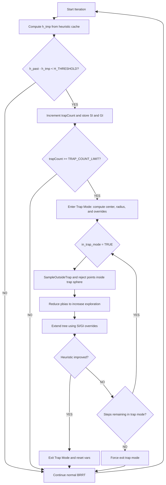

<!-- %%{init: {'flowchart': {'nodeSpacing': 60, 'rankSpacing': 70}, 'themeVariables': {'fontSize': '18px'}}}%% -->

```mermaid
%%{init: {
    'flowchart': {
        'nodeSpacing': 5,
        'rankSpacing': 10,
        'useMaxWidth': false
    },
    'themeVariables': {'fontSize': '10px'}
}}%%


flowchart TB
    A[Start Iteration] --> B[Compute h_tmp from heuristic cache]
    B --> C{h_past - h_tmp < H_THRESHOLD?}

    C -- YES --> D[Increment trapCount and store SI and GI]
    D --> E{trapCount >= TRAP_COUNT_LIMIT?}
    C -- NO --> F[Continue normal BRRT]

    E -- NO --> F[Continue normal BRRT]
    F --> A

    E -- YES --> G[Enter Trap Mode: compute center, radius, and overrides]

    G --> H{in_trap_mode = TRUE}
    H --> I[SampleOutsideTrap and reject points inside trap sphere]
    I --> J[Reduce pbias to increase exploration]
    J --> K[Extend tree using SI/GI overrides]

    K --> L{Heuristic improved?}

    L -- YES --> M[Exit Trap Mode and reset vars]
    M --> F

    L -- NO --> N{Steps remaining in trap mode?}
    N -- YES --> H
    N -- NO --> O[Force exit trap mode]
    O --> F
``` 
